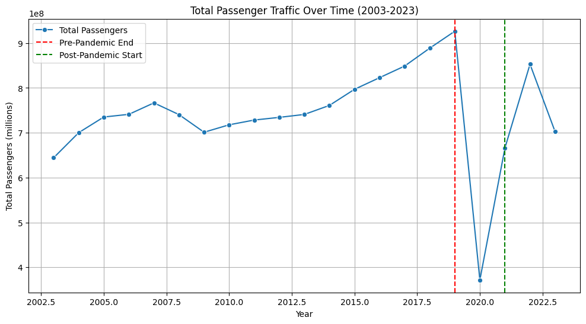
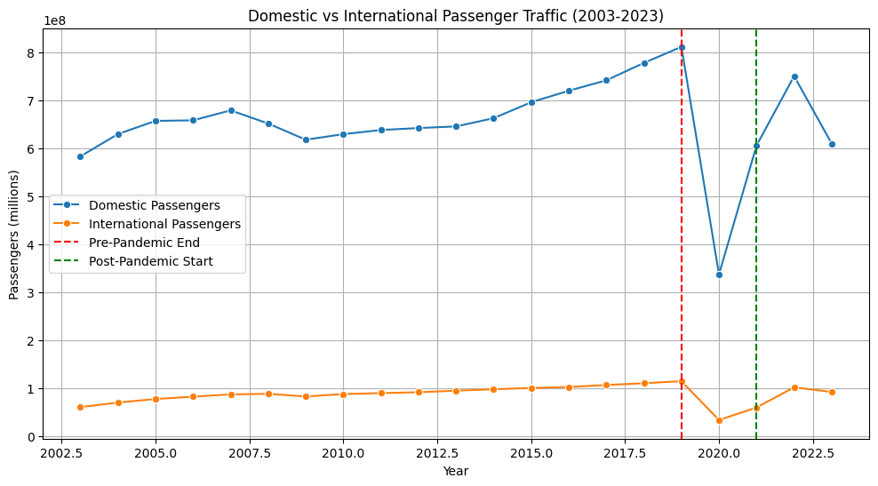
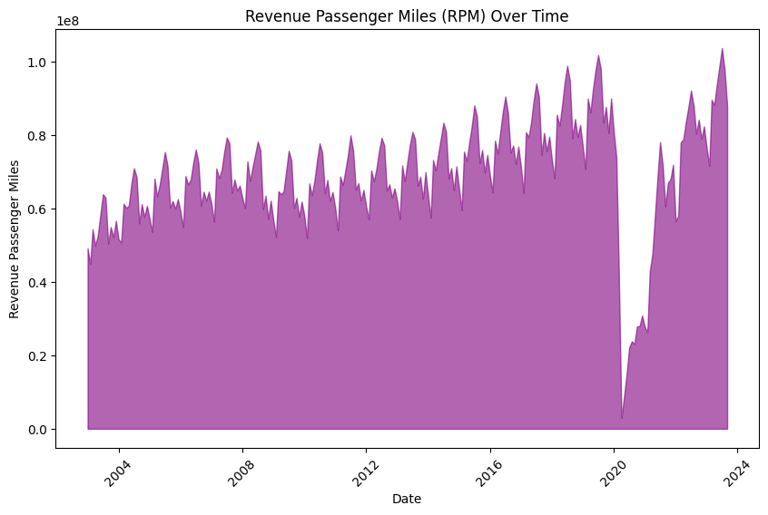
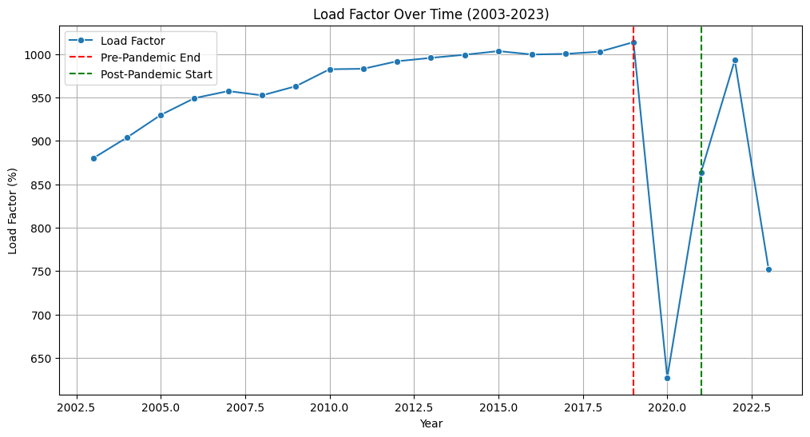
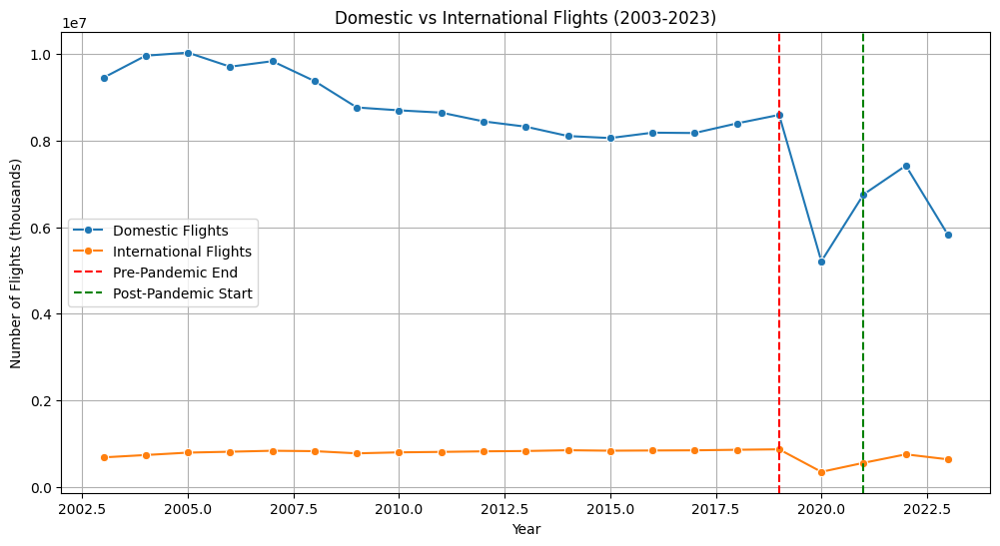
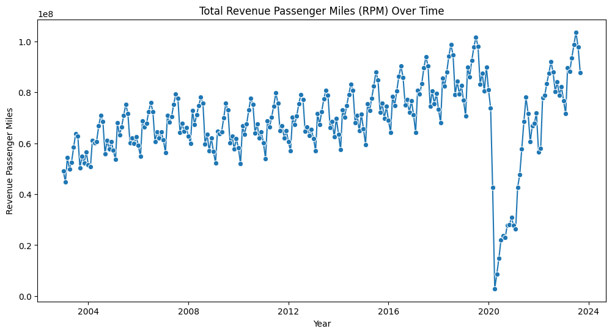

# Exploring Post Pandemic Trajectory for Airlines
[Link to Dataset ](https://www.kaggle.com/datasets/yyxian/u-s-airline-traffic-data)
## References

1. Yian, Y. (2023). U.S. Airline Traffic Data (2003-2023) [Dataset]. Kaggle. Retrieved from https://www.kaggle.com/datasets/yyxian/u-s-airline-traffic-data
  2.  McKinsey & Company. (2023). The future of air travel post-pandemic: Navigating recovery and long-term shifts in aviation. Retrieved from https://www.mckinsey.com/industries/travel-logistics-and-infrastructure/our-insights
  3. Massachusetts Institute of Technology. (n.d.). MIT airline data project. MIT International Center for Air Transportation. Retrieved February 2025, from http://airlinedataproject.mit.edu/
  4. OpenAI. (2025). ChatGPT (Feb 4 version) [Large language model]. https://openai.com/chatgpt - Used for pre-processing steps and data visualization
  ## Introduction
  The COVID-19 pandemic significantly impacted the airline industry, causing a sharp decline in passenger traffic, flight frequency, and overall performance. As countries begin to recover from the pandemic, it's important to understand how the airline industry is bouncing back and the factors influencing this recovery. This project focuses on analyzing the recovery of U.S. airlines from 2003 to 2023, with an emphasis on the post-pandemic period. The key questions driving this analysis are: How has airline traffic recovered since the peak of the pandemic? Are there notable differences in recovery between domestic and international flights? Which regions or airlines are seeing faster recoveries? Additionally, the project explores the influence of factors such as seasonal variations, flight operations, and changes in passenger demand on the industry's recovery. The insights from this analysis will help provide a clearer picture of the airline industry's post-pandemic recovery and offer valuable information to stakeholders, including airline operators, policymakers, and passengers.

The data used in this project was sourced from the U.S. Bureau of Transportation Statistics (BTS), which provides comprehensive, publicly available data on U.S. air travel. The dataset spans from 2003 to 2023 and includes key performance indicators such as the number of domestic and international passengers, total flights, available seat miles (ASM), and revenue passenger miles (RPM), among others. Key features include Year and Month to track the time period, Dom_Pax (domestic passengers) and Int_Pax (international passengers) for passenger counts, Dom_Flt and Int_Flt for the number of flights, RPM and ASM for measuring the flight capacity and distance flown, and LF (load factor) for efficiency analysis. These features allow for an in-depth analysis of trends in the airline industry over time, particularly around the impacts of external events like the COVID-19 pandemic. 

## Pre-Processing Steps

1. **Import Libraries**: The first step is to import necessary libraries, like Pandas for data manipulation, NumPy for numerical operations, and Matplotlib/Seaborn for data visualization. These libraries are essential for efficiently processing, analyzing, and visualizing data. Without these libraries, handling the dataset and performing operations like grouping, aggregating, and plotting would not be possible. 

2. **Load and Inspect the dataset**: The dataset is loaded into a Pandas DataFrame to allow for easy manipulation. Inspecting the dataset helps identify its structure, missing values, and data types, enabling us to understand what further cleaning is necessary. By inspecting the data, we can also check for inconsistencies or any non-standard formatting, such as commas in numbers or misaligned columns.

3. **Create a Date Column Using "Year" and "Month"** : Since the data has separate columns for year and month, combining them into a single date column makes it easier to work with time-based operations. A date column simplifies the analysis of trends over time, as we can use Pandas’ datetime functionalities for aggregation and plotting.

4. **Set Date as Index**: Setting the new date column as the index helps streamline time-series analysis. By having the date as the index, it becomes easier to filter data by specific time periods and perform operations like resampling and aggregation. This also improves the readability of visualizations as the x-axis will automatically represent time.

5. **Handling Missing Values**:  Missing data can lead to misleading results or errors in analysis. In this step, we check for any null or missing values and handle them appropriately. This may involve imputing values, filling with forward or backward values, or dropping rows/columns that are irreparably missing data. Handling missing values ensures that the analysis remains accurate and doesn't skew results.

6. **Convert Numeric Columns to Correct Types**: Some columns, such as passenger counts or flight numbers, may have been loaded as strings (due to commas in the data). These columns need to be converted into numeric types (e.g., integers or floats) so they can be used for calculations and aggregations. This step ensures that operations like summing, averaging, or visualizing data are done correctly.

7. **Group Data by Year**: Grouping the data by year allows us to focus on yearly trends rather than monthly fluctuations. This simplifies the analysis and helps draw general conclusions about how the airline industry was affected over time. Aggregating by year also prepares the data for the next step of analyzing specific periods, such as pre-pandemic or post-pandemic.

8. **Define Pre-Pandemic, Pandemic, and Post-Pandemic Periods**: This step segments the data into three distinct periods—pre-pandemic, pandemic, and post-pandemic—so we can analyze how the airline industry was impacted by COVID-19. By defining these periods based on the year (for instance, pre-pandemic being 2003-2019, pandemic from 2020-2021, and post-pandemic starting in 2022), we can isolate the effect of the pandemic on the airline industry and identify recovery trends. This segmentation is crucial for understanding the broader impact of global events on the industry. 

## Visualization

**Total Passenger Traffic (Pax) Over Time**:
The total passenger traffic saw steady growth until 2019, reflecting the increasing demand for air travel. However, the pandemic caused a sharp decline in 2020, with travel restrictions and safety concerns leading to a significant drop in passengers. After 2021, the recovery phase began, and the number of passengers gradually increased as travel restrictions were lifted and people resumed flying.

**Passenger Traffic Breakdown by Domestic vs International (Pax)**: Before the pandemic, both domestic and international passenger traffic grew at a steady pace, with domestic traffic leading. The pandemic severely impacted international travel, which saw a larger drop than domestic traffic. However, post-pandemic, domestic travel bounced back relatively quickly, while international travel took more time to recover due to ongoing restrictions and slower global recovery.

**Revenue Passenger Miles (RPM)**: RPM, which measures the total distance flown by paying passengers, showed a steady upward trend before the pandemic, reflecting the growing demand for air travel. The pandemic caused a significant drop in RPM in 2020, as fewer flights were available and fewer passengers were flying. After the pandemic's peak, RPM began to recover in 2021, indicating a rise in both the number of flights and the distance flown by passengers.

**Load Factor Over Time (Efficiency of Airlines)**: The load factor, which measures the percentage of available seats filled with passengers, steadily increased before the pandemic, showing that airlines were efficiently filling seats. During the pandemic, the load factor dropped as flights operated at lower capacities due to travel restrictions. Post-pandemic, the load factor began to rise again, reflecting airlines' improved efficiency and more passengers returning to air travel.

**Domestic vs International Flights (Flights) Over Time**: Before the pandemic, both domestic and international flights were on the rise, with domestic flights consistently higher than international ones. The pandemic caused a massive decline in international flights, while domestic flights saw a smaller reduction. Post-pandemic, domestic flights experienced a quicker recovery, while international flights lagged behind, reflecting the global nature of recovery and ongoing challenges in international travel.

**Freight and Mail (Freight and Mail Tonnes) Over Time** : Before the pandemic, freight and mail traffic grew steadily, driven by global trade and logistics. However, the pandemic caused a sharp decline in 2020 due to disruptions in supply chains and reduced demand. After 2021, freight and mail volumes began recovering as logistics networks stabilized, and demand for goods and services started to increase again, albeit at a slower pace than passenger traffic.

## Impact Section
This project, which examines the post-pandemic recovery of airlines using U.S. traffic data, has some potential impacts and limitations. One concern is that the visualizations may oversimplify the recovery trends, possibly leading to misleading conclusions. For instance, showing recovery in certain areas might give the false impression that the entire industry has bounced back, while smaller carriers or specific regions may still be struggling. Additionally, the dataset doesn't account for several important factors, like fluctuating fuel prices, changes in government policies, or international travel restrictions, which all play a big role in recovery. The analysis also leaves out important perspectives, like the socioeconomic factors affecting different types of travelers, and it doesn't touch on the environmental impact of air travel, which is becoming increasingly important. While the dataset doesn’t contain personal information, there could still be biases in the data itself, such as the underrepresentation of smaller airlines or regions. This could lead to incomplete or skewed conclusions, which might influence decisions in ways that benefit some sectors more than others. Overall, it’s important to consider these limitations when interpreting the results to avoid drawing misleading conclusions or making decisions based on incomplete data.

## Conclusion
This project examined the post-pandemic recovery of the airline industry using U.S. airline traffic data from 2003 to 2023. Through data preprocessing—handling missing values, converting data types, and categorizing time periods—we developed a structured analysis of key industry trends. The visualizations highlight the severe decline in airline operations during the pandemic (2020-2021) and the subsequent recovery. However, while passenger volumes and revenue passenger miles (RPM) have rebounded, the pace of recovery varies across different metrics, suggesting long-term shifts in travel demand and airline operations. These findings emphasize the pandemic's lasting impact on the industry, demonstrating the value of data-driven approaches in evaluating market resilience and informing strategic decision-making in response to global disruptions.
